## 一、前言

PP-ShiTu 库管理工具，此工具是为了用户能够可视化的管理图像及对应的index库，用户可根据实际情况，灵活的增删改查相应的gallery图像库及索引文件，在提升用户体验的同时，辅助PP-ShiTu在实际应用的过程中达到更好的效果。

今天教大家使用 PP-ShiTu 库管理工具，可视化管理图像库。

- 教程运行环境

|名称|版本|
|:--|--:|
|操作系统|Debian V11|
|PaddlePaddle(CPU 版)|V2.3.2|
|PaddleClas|V2.5|
|PP-ShiTu 库管理工具|V1.0|
|conda|V4.13.0|
|git|V2.34.1|

<div align="center">
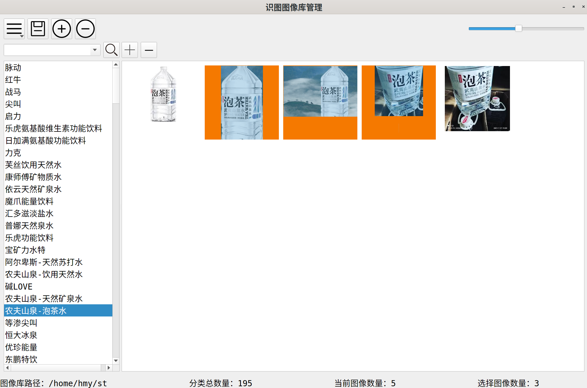
<p>界面展示</p>
</div>

## 二、搭建运行环境

- **如果不是 conda 环境可以跳过1、2步骤**

### 1、创建 conda 环境

```bash
conda create -n ppst python=3.8
```

### 2、进入 conda ppst 环境

```bash
conda activate ppst
```

### 3、到 [百度飞桨官网](https://www.paddlepaddle.org.cn/) 安装 PaddlePaddle

### 4、安装 PaddleClas

```bash
pip install paddleclas
```

### 5、为了使用方便，下载 PaddleClas 源代码，根据网络环境自己选择 github 或者 gitee，教程选择的是 github

```bash
# 新建 shitu 目录
mkdir shitu
# 进入 shitu 目录
cd shitu
# 国外 github
git clone https://github.com/PaddlePaddle/PaddleClas.git -b release/2.5 PaddleClas
# 国内 gitee
# git clone https://gitee.com/paddlepaddle/PaddleClas.git -b release/2.5 PaddleClas
```

### 6、安装 PP-ShiTu 库管理工具依赖

```bash
pip install fastapi
pip install uvicorn
pip install pyqt5
pip install psutil
```

## 三、模型及数据准备

- 在上面 shitu 目录下继续操作，下载及准备 inference model，并修改好${PaddleClas}/deploy/configs/inference_drink.yaml的相关参数，同时准备好数据集。在具体使用时，请替换好自己的数据集及模型文件。

```bash
cd PaddleClas/deploy/shitu_index_manager
# 新建模型目录
mkdir models
cd models
# 下载及解压识别模型
wget https://paddle-imagenet-models-name.bj.bcebos.com/dygraph/rec/models/inference/PP-ShiTuV2/general_PPLCNetV2_base_pretrained_v1.0_infer.tar && tar -xf general_PPLCNetV2_base_pretrained_v1.0_infer.tar
# 返回上级目录
cd ..
# 下载及解压示例数据集
wget https://paddle-imagenet-models-name.bj.bcebos.com/dygraph/rec/data/drink_dataset_v2.0.tar && tar -xf drink_dataset_v2.0.tar
```

- 运行环境的主要目录结构

```bash
shitu_index_manager
├── client.py
├── drink_dataset_v2.0  # 示例数据集
│   ├── gallery
│   ├── index
│   └── test_images
├── index_manager.py
├── mod
├── models
│   └── general_PPLCNetV2_base_pretrained_v1.0_infer  # 识别模型
├── resource
├── server.py
└── ui
```

## 四、运行程序

- 运行方式如下，在上面 shitu 目录下继续操作

```bash
# 进入识图管理程序目录
cd PaddleClas/deploy/shitu_index_manager
# 复制模型配置
cp ../configs/inference_drink.yaml .
# 注意如果没有按照上面步骤准备数据集及代码，请手动修改inference_drink.yaml，做好适配
# 启动服务器端
python3 server.py -c inference_drink.yaml
# 另开启新的终端，进入上面相同的目录后，启动客户端
python3 client.py
# 由于版本问题，下面命令等同于上面 启动服务器端 启动客户端 步骤
# python3 index_manager.py -c inference_drink.yaml
```

## 五、操作手册

### 1、界面功能介绍

<div align="center">
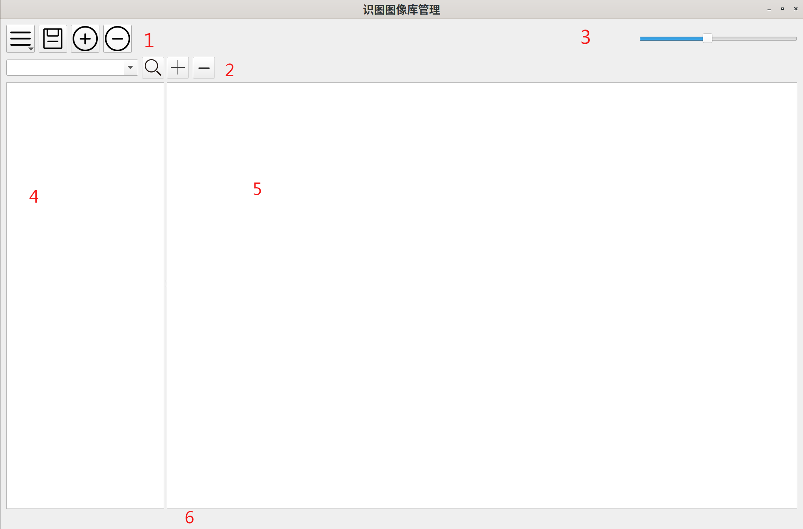
<p>界面功能介绍</p>
</div>

- 1区：从左至右，主要功能按钮、保存按钮、新增类别按钮、删减类别按钮。
- 2区：从左至右，搜索框、搜索确定键、新加图像按钮、删除图像按钮。
- 3区：图像缩放，往左拖动滑块缩小，往右拖动滑块放大。
- 4区：分类列表区，**注意：没有打开图像库的时候无相关菜单**。
- 5区：图像预览区，**注意：没有打开图像库的时候无相关菜单**。
- 6区：状态栏，信息显示区。

<div align="center">
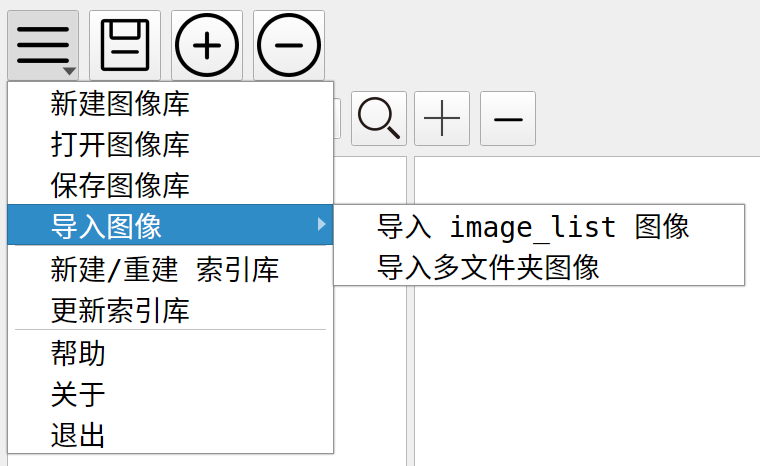
<p>功能菜单</p>
</div>

### 2、新建图像库

- 点击新建库功能后，会选择一个空的存储目录或者新建目录，此时所有的图片及对应的索引库都会存放在此目录下。完成操作后，如下图所示。
- 教程示例：点击菜单栏新建图像库，会提示打开一个文件夹，此时请创建一个新的文件夹，并打开。如在${PaddleClas}/deploy/shitu_index_manager下新建一个drink_index文件夹。

<div align="center">
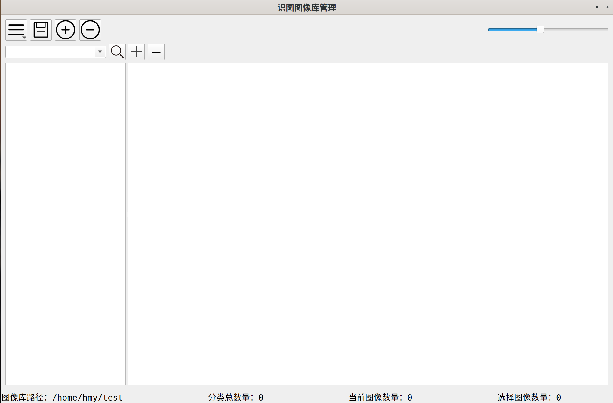
<p>新建库</p>
</div>

### 3、打开图像库
- 此功能是，用此工具存储好的库，进行打开编辑。注意，打开库时，请选择打开的是新建库时文件夹路径。打开库后，示例如下。

<div align="center">

<p>打开库</p>
</div>

### 4、导入图像

- 在打开图像库或者新建图像库完成后，可以使用导入图像功能，即导入用户自己生成好的图像库。具体有支持两种导入格式。

<div align="center">

<p>导入图像</p>
</div>

- image_list格式：打开具体的.txt文件。.txt文件中每一行格式： image_path label。跟据文件路径及label导入。

<div align="center">
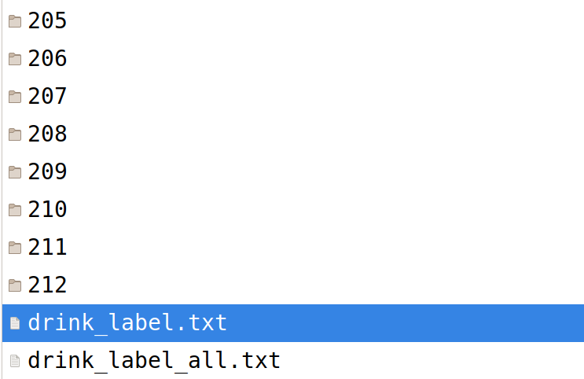
<p>image_list格式</p>
</div>

- 多文件夹格式：打开具体文件夹，此文件夹下存储多个子文件夹，每个子文件夹名字为label_name，每个子文件夹中存储对应的图像数据，类似于以下的目录。

<div align="center">
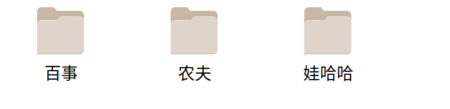
<p>多文件夹格式</p>
</div>

### 5、图像操作
- 选择图像后，鼠标右击可以进行如下操作，可以根据需求，选择具体的操作，注意修改完成图像后，请点击保存按钮，进行保存。
- Ctrl + 鼠标左键单击，单选多图像。
- Shift + 鼠标左键单击，区间多选图像。

<div align="center">
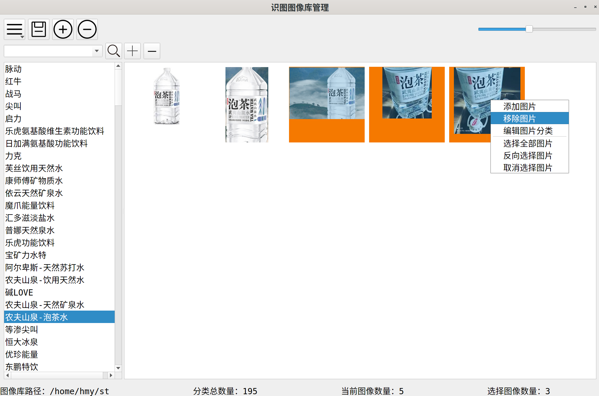
<p>图像操作菜单</p>
</div>

- 选择编辑图片分类，弹出图片分类对话框，可以重新设定图片的分类。

<div align="center">

<p>编辑图片分类</p>
</div>

### 6、图像分类操作

- 选择图像分类后鼠标右键弹出以下功能：添加分类，移除分类，重命名分类。

<div align="center">
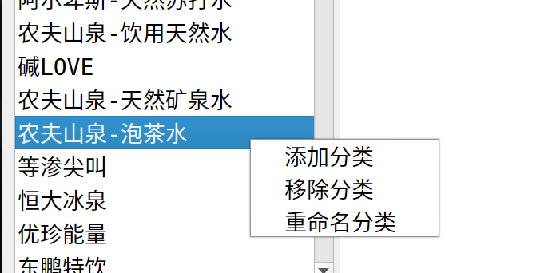
<p>图像分类菜单</p>
</div>

<div align="center">
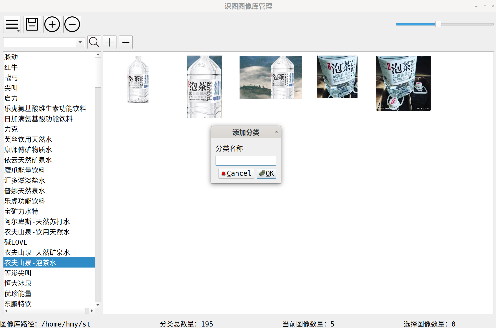
<p>添加分类</p>
</div>

<div align="center">
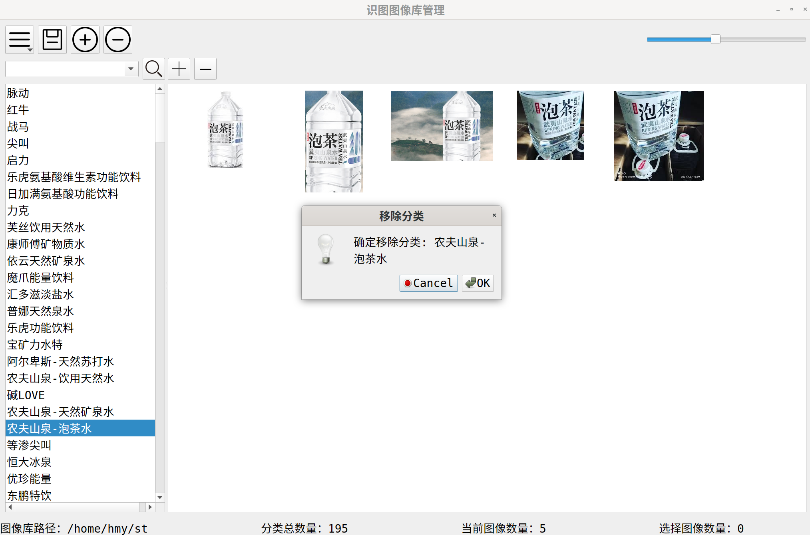
<p>移除分类</p>
</div>

<div align="center">
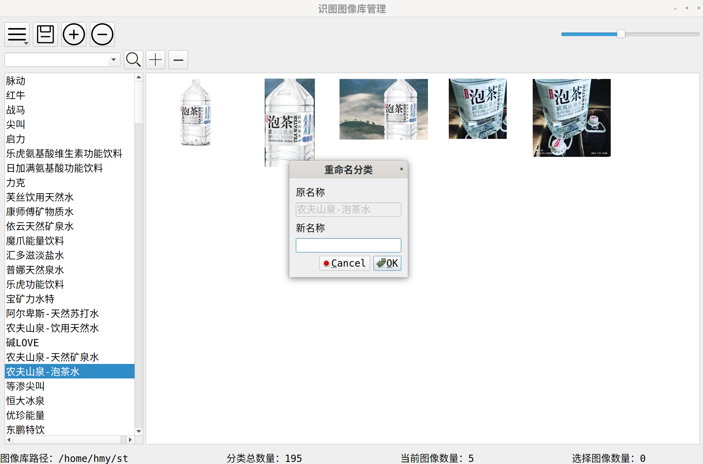
<p>重命名分类</p>
</div>

- 搜索分类：在上面的2区，**搜索框**输入关键字、点击**搜索确定键**或者回车键，就可以查找分类，支持中文搜索。

<div align="center">
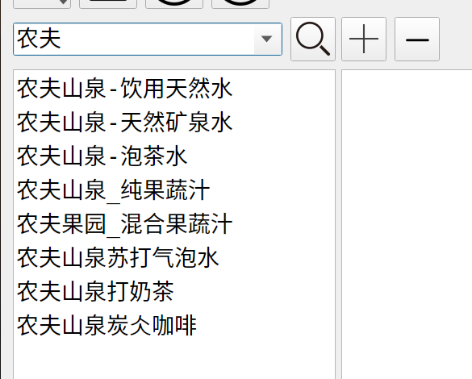
<p>搜索分类</p>
</div>

### 7、生成、更新index库

- 在用户完成图像库的新建、打开或者修改，并完成保存操作后。可以点击主要功能按钮中新建/重建索引库、更新索引库等功能，进行索引库的新建或者更新，生成PP-ShiTu使用的Index库。

<div align="center">
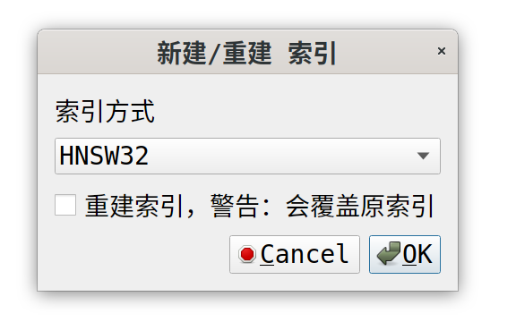
<p>新建索引库对话框</p>
</div>

- 如果图像过多，新建/重建索引库，时间会比较长，请耐心等候。

<div align="center">
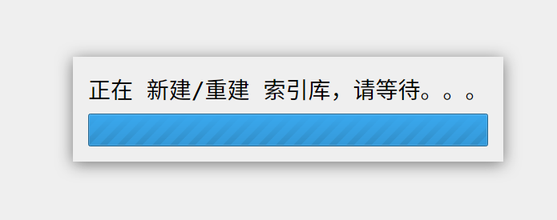
<p>新建索引库等待提示</p>
</div>

- 如果新建索引库成功后将显示，成功对话框。

<div align="center">
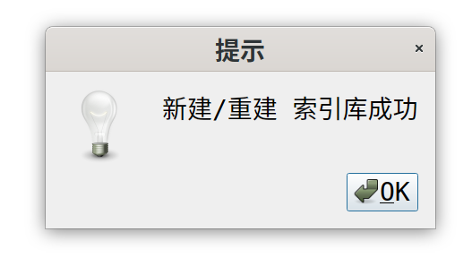
<p>索引库成功</p>
</div>

### 8、生成文件介绍

- 使用此工具后，会生成如下格式的文件

```bash
index_root/            # 库存储目录
|-- image_list.txt     # 图像列表，每行：image_path label。由前端生成及修改，后端只读
|-- images             # 图像存储目录，由前端生成及增删查等操作。后端只读
|   |-- md5.jpg
|   |-- md5.jpg  
|   |-- ……  
|-- features.pkl       # 建库之后，保存的embedding向量，后端生成，前端无需操作
|-- index              # 真正的生成的index库存储目录，后端生成及操作，前端无需操作。
|   |-- vector.index   # faiss生成的索引库
|   |-- id_map.pkl     # 索引文件
```

其中index_root是使用此工具时，用户选择的存储目录，库的索引文件存储在index文件夹中。

使用PP-ShiTu时，索引文件目录需换成index文件夹的地址。

### 9、注意事项

- 利用此工具生成的index库，如drink_index文件夹，请妥善存储。之后，可以继续使用此工具中打开图像库功能，打开drink_index文件夹，继续对index库进行增删改查操作，具体功能可以查看功能介绍。
- 打开一个生成好的库，在其上面进行增删改查操作后，请及时保存。保存后并及时使用菜单中更新索引库功能，对索引库进行更新。
- 如果要使用自己的图像库文件，图像生成格式如示例数据格式，生成image_list.txt或者多文件夹存储，二选一。

## 六、已知缺陷

- Linux 操作系统：PyQt5 和 Fcitx 中文输入法之间兼容性存在问题，造成无法输入中文，临时解决方法，用其它文本编辑器输入中文后复制，在 PP-ShiTu 库管理工具中粘帖(Ctrl+V)
- Linux 操作系统：**IBus 输入法正常使用**

## 七、教程运行环境补充说明

- 由于本教程的实体机是 Ubuntu 22.0.4，无法运行 PaddlePaddle V2.3.2。所以本教程实际是运行在 Debian 11 虚拟机环境，故此安装的是 PaddlePaddle CPU V2.3.2 版本。

## 八、感谢

- 百度飞桨 [PaddleClas](https://github.com/PaddlePaddle/PaddleClas) 团队
- PaddleClas 文档编辑人员
- 后端作者 PaddleClas 成员 [RainFrost1](https://github.com/RainFrost1)
- 前端作者 [qtcn.org](http://www.qtcn.org) 国内Qt论坛总版主 [小熊宝宝](https://github.com/cnhemiya) :)
- [前端原项目地址](https://github.com/cnhemiya/shitu-manager)
